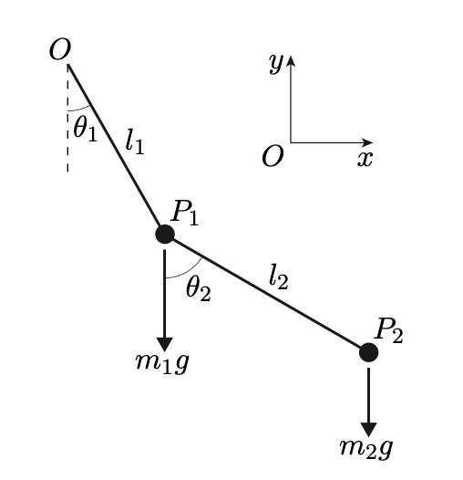

# Double Pendulum Equations of Motion

### Lagrangian Formulation

----

#### The above figure shows simple pendulum suspended from another simple pendulum by a frictionless hinge. 
- Both pendulums move in the same plane. 
- In this system, the rods $OP_1$ and $P_1P_2$ are rigid, massless and inextensible.
- The system has two degrees of freedom and is uniquely determined by the values of $\theta_1$ and $\theta_2$

----

We solve the Euler-Lagrange equations for $\textbf{q} = [\theta_1, \theta_2]$ such that, 

$$
\frac{\text{d}}{\text{d}t}\left(\frac{\partial L}{\partial \dot{\textbf{q}}}\right)-\frac{\partial L}{\partial \textbf{q}}=0
$$

The result is a system of $|\textbf{q}|$ coupled, second-order differential equations

----

The equations are uncoupled by letting $\omega_i = \frac{\text{d}}{\text{d} t}\theta_i$

So $\omega_i$ for $i=1,2$ represents the angular velocity with $\frac{\text{d}}{\text{d} t}\omega_i \equiv \frac{\text{d}^2}{\text{d}^2 t}\theta_i$

#### [Derivation](https://github.com/pineapple-bois/Double_Pendulum/blob/master/Derivation.ipynb)

----

### [Model rod simulation](https://github.com/pineapple-bois/Double_Pendulum/blob/master/Simulation.ipynb)

Systems illustrating periodic/chaotic behaviour are explored.

The gif below shows chaotic motion with release from rest for large initial angles $[\theta_1=-105 \degree, \theta_2=105 \degree]$

----

### [Rods with non-zero mass simulation](https://github.com/pineapple-bois/Double_Pendulum/tree/master/Compound_Double_Pendulum)

The rods $OP_1$ and $P_1P_2$ are now modeled as rigid and inextensible with uniformly distributed mass, $M_1$ and $M_2$. This significantly influences the pendulum dynamics.

#### [Derivation](https://github.com/pineapple-bois/Double_Pendulum/blob/master/Compound_Double_Pendulum/Derivation_Moments.ipynb)

The gif below shows release from rest for large initial angles $[\theta_1=-105 \degree, \theta_2=105 \degree]$ as above.

In this simulation;
- $m_1=m_2=M_1=M_2=1\text{kg}$
- $l_1=2l_2$ 

----

This project operates under the [MIT](LICENSE.md) licence

----

#### Next steps

- Creating Dash app
- Dynamically creating the trace plot on the animation
  - The method I tried was computational expensive - need workaround
  - Non-functioning [boiler plate code](https://github.com/pineapple-bois/Double_Pendulum/blob/master/To_do/dynamic_traces.py)
- Quantifying chaotic behaviour.

----
